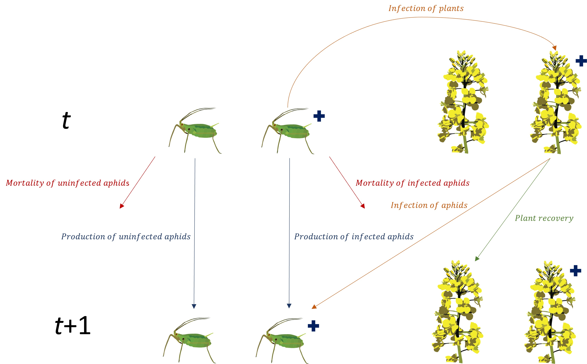

<!-- README.md is generated from README.Rmd. Please edit that file -->

# EndoSim 

[](https://github.com/cesaraustralia/EndoSim)
[](https://github.com/cesaraustralia/EndoSim/actions)
[](https://www.repostatus.org/#active)
[-blue.svg)](https://cran.r-project.org/web/licenses/GPL%20(%3E=%203))

**EndoSim** is a package designed to parameterise and run simulations
using the AGPIP Endosymbiont model developed by [Cesar
Australia](https://cesaraustralia.com/) and
[PEARG](https://blogs.unimelb.edu.au/pearg/home/).

## Installation

**EndoSim** can be installed by running the following code:

``` r
# install package from GitHub
require(devtools)
devtools::install_github("cesaraustralia/EndoSim")
```

## The EndoSim model

The **EndoSim** model is a modular discrete-time model to simulate
interactions between pests and endosymbionts. The main purpose of the
model is to simulate pest dynamics when infected by an endosymbiont with
deleterious effects on pest fitness. Currently, the model is designed
for aphid pests which reproduce asexually, and for endosymbionts that
can be transmitted vertically (via offspring inheriting endosymbionts
from their mothers) or horizontally (via feeding on a crop plant). Full
details of the model can be found in the accompanying paper (Slavenko
*et al.* in prep).



## Usage

A model simulation can be run by using the `endosim()` function. This
function accepts as input six objects of unique classes:

1.  **Pest**: object of class `pest()` – includes all the functions
    defining the pest’s population dynamics, including development,
    fecundity, mortality, and immigration and emigration.

2.  **Endosymbiont**: object of class `endosym()` – includes the
    endosymbiont’s fitness cost and functions defining horizontal
    transmission rates, as well as the date of initial introduction to
    the population and the number of infected individuals introduced.

3.  **Crop**: object of class `crop()` - includes the half-time of
    endosymbiont plant recovery, sowing, emergence and harvest dates, a
    function defining how pest carrying capacity changes based on time
    after crop emergence, and the crop density (in m<sup>2</sup>).

4.  **Parasitoid**: object of class `parasitoid()` – includes all the
    functions defining the parasitoid’s population dynamics and
    behaviour, including development, attack rates and handling times,
    as well as the date of initial introduction to the population and
    the number of individuals introduced.

5.  **init**: object of class `initial()` – defining the numbers of crop
    plants, and R+ and R- pests at the start of the simulations.

6.  **conds**: object of class `sim_conds()` – defining the length of
    the simulation and environmental conditions (rainfall, min, max and
    mean temperature) in each daily timestep. Conditions for a given
    location can be generated with the `make_conds()` function, which
    accepts a start and end date for the simulation and GPS coordinates
    (in decimal degrees) of the location. Environmental data are then
    downloaded from [SILO](https://www.longpaddock.qld.gov.au/silo/)
    gridded daily climate surface layers (derived either by splining or
    kriging observational data from weather stations) and extracted for
    the required coordinates and dates.

The user can then use logical arguments to switch on or off different
modules. Currently available are vertical transmission of the
endosymbiont (**vert_trans**), horizontal transmission of the
endosymbiont (**hori_trans**), immigration (**imi**), emigration
(**emi**), and parasitoids (**para**). The function will then generate
an object of class `endosim_mod()` which contains the output of the
simulation, including daily summaries of the number of infected and
uninfected pests. A simulation output can be plotted using a generic
`plot()` function, which can plot time-series of the total daily number
of pests (`type = “pop_size”`; default), the daily proportion of
infected pests in the population (`type = “R+”`), or the daily
proportion of pests in different life-stages (`type = “demo”`).

The package offers users great flexibility in setting up their
simulations, in terms of initial population sizes, crop dynamics, dates
of introduction of infected aphids and parasitoids, and propagule
pressure of the initial introductions. Additionally, to facilitate
exploration of how the different modules can affect pest populations,
the `counterfact()` function can be used. This function accepts the same
inputs as `endosim()`, as well as a list defining the scenarios to be
explored. Each module can either be fixed to activated, fixed to
deactivated, or set to be either activated or deactivated. The function
then runs a set of simulations, with all combinations of modules that
are not fixed, and stores them in an object of class `endosim_col()`.
Generic `summary()` and `plot()` functions allow comparison of pest
dynamics between all scenarios.

### Additional information and contact info

This project was funded by the Grains Research and Development
Corporation (GRDC) as part of the Australian Grains Pest Innovation
Program (AGPIP).

Full details of the model can be found in the following publication:

Slavenko A, Ross PA, Mata L, Hoffmann AA & Umina PA (2024) Modelling
the spread of a novel endosymbiont infection in field populations of
an aphid pest. *Annals of Applied Biology*, **185**, 242-254,
https://doi.org/10.1111/aab.12911

For any questions about the model, suggestions for the package, or
requests for information or new functionalities, please contact [Alex
Slavenko](mailto:aslavenko@cesaraustralia.com?subject=EndoSim) at Cesar
Australia.

<!-- logos: start -->


<!-- logos: start -->
